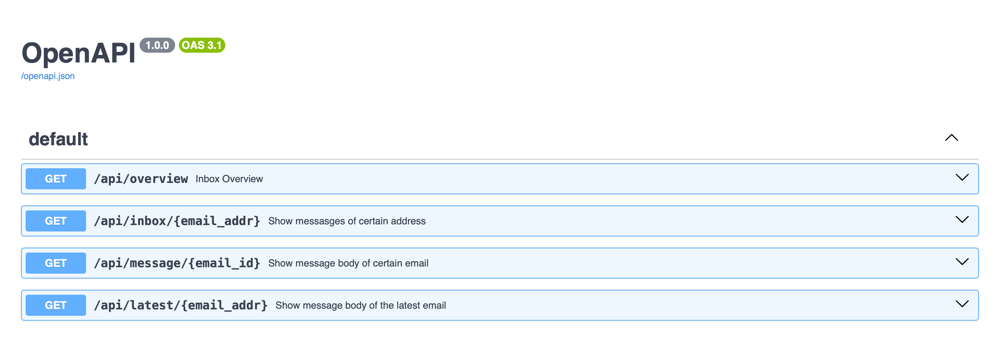

# WorkerMail

## Get started

1. Sign up for [Cloudflare Workers](https://workers.dev). The free tier is more than enough for most use cases.
2. Create a D1 database in Cloudflare Workers and replace the `database_name` and `database_id` in `wrangler.toml` with your own.
3. Clone this project and install dependencies with `npm install`
4. Run `wrangler login` to login to your Cloudflare account in wrangler
5. Run `wrangler deploy` to publish the API to Cloudflare Workers
6. (First time only) Open `https://worker-address.example.com/init` in your browser to initialize the database.
7. Open `https://worker-address.example.com/` in your browser to see the Swagger interface where you can try the endpoints.
8. Route the email addresses that you want to use with this project to the worker in your Cloudflare dashboard.

## LICENSE
MIT License @ 2024 Rikki (i@rikki.moe)